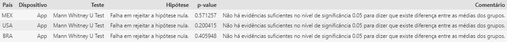

# E-Commerce Eletronic House

## O objetivo deste projeto é realizar um teste A/B para avaliar se o formulário de preenchimento automático desenvolvido pelo Head de Design e seu time é melhor do que o formulário atual de preenchimento manual.

# 1. Problema de Negócio.

Eletronic house é um e-commerce que vende computadores e produtos eletrônicos — mouse, monitores, teclados, laptops, entre outros. Os produtos são vendidos no Brasil e em diversos países da Europa e da América do Norte.

O diretor de de produtos solicitou ao Head de design que desenvolvesse uma nova forma de finalizar a compra com cartão de crédito, uma que que não houvesse a necessidade de o cliente preencher manualmente todas as informações do cartão, e que funcionasse em todos os países.

Após meses desenvolvendo a ferramenta, o time de desenvolvimento back-end entregou a solução de pagamentos, em que 90% das informações do formulário eram preenchidas de forma automática.

O Head de Design quer medir a efetividade da nova ferramenta na página de vendas e reportar os resultados ao Diretor de Produtos para concluir se a nova forma de pagamento é melhor do que a antiga.

As duas páginas foram colocadas no ar durante meses e o time de front-end desenvolveu uma automação que atribui um rótulo para cada cliente, mostrando qual página de vendas aquele determinado cliente estava visualizando. Os dados foram armazenados em um banco de dados.

O time de design não possui as habilidades necessárias para avaliar os dados e concluir o experimento. Então eles resolveram contratar um freelancer (eu) para analisar e validar a efetividade da nova forma de pagamento.

Questão de Negócio a ser respondida:

    1. Qual a melhor forma de pagamento: preenchimento manual ou automático?

# 2. Premissas.

Vamos considerar que os dados foram coletados por alguns meses.

## 2.1 Dicionário dos dados

|Atributo|Tipo|Descrição|
|-------|----|-----------|
|uid|int64| Identificador único do cliente|
|country|object| País do cliente|
|gender|object| Gênero do cliente|
|spent|int64| Total gasto na transação|
|purchases|int64| Número de compras realizadas na transação|
|date|datetime64[ns]| Data da compra|
|group|object| GROUP B (Controle) ->  Manual , GROUP A (Tratamento) -> Automático|
|device |object| Dispositivo em que a compra foi realizada (I-> Site, A -> App)|

Os Dados utilizados neste projeto estão disponíveis em meu [drive](https://drive.google.com/file/d/1y9DOByzAf-I6RS7C7vjc7BDhL9OREMQy/view)
  

# 3. Estratégia de Solução

Minha estratégia para resolver este problema foi a seguinte:

**Step 01. Carregamento e Descrição dos Dados:** Carregar os dados, Verificar estatísticas descritivas dos dado, Checar se há alguma inconsistência nos dados (dados faltantes, clientes designados para grupo controle e tratamento, tipo de dado, etc.).

**Step 02. [Análise Exploratória](notebooks/exploratory_data_analysis.ipynb):** Análise exploratória para verificar alguma diferença entre os grupos antes de realizarmos o test estatístico.

**Step 03. [Design do Experimento](notebooks/hypothesis_testing_summary_test.ipynb):** Definição das hipóteses nula e alternativa, e da métrica a ser testada. Definição dos parâmetros do teste estatístico (nível de significância, poder estatístico e efeito prático) para definirmos o tamanho da amostra necessária para obtermos resultados confiáveis com os testes.

**Step 04. Teste de Hipótese:** Definir e realizar do teste adequado de acordo com os dados que temos. Cálculo do valor p e decisão de rejeitar ou aceitar a hipótese nula.

**Step 0.5 Resultados/Conclusão:** Apresentar resultados ao time de design respondendo a questão de negócio.
  

# 4. Resultados

No design de experimento definimos que iríamos conduzir o teste para cada país por tipo de dispotivo utilizado para acessar a página. A seguinte hipótese seria testada para cada caso:

**Hipótese Nula:** O preenchimento automático e o preenchimento manual possuem médias de gastos iguais.

**Hipótese Alternativa:** As médias de gastos das duas formas de pagamento são diferentes.

## Site

## App

# 5. Conclusão

Com os parâmetros utilizados, não foi possível realizar testes para os seguintes países: Espanha, Grã Bretanha, Turquia, Alemanha, França, Austria e Canada. Então reportamos ao time de negócio que precisamos coletar mais dados para estes países, se quisermos realizar testes com resultados confiáveis.

Foi possível realizar os testes para Estados Unidos, Brasil e México — tanto para o site quanto para o app. Mas não obtivemos resultados estatisticamente significativos para dizer que há diferença entre as médias do preenchimento automático e manual.

Possíveis cenários:

- Existe algum problema — bug, problema de latência — no formulário de preenchimento automático que esteja atrapalhando a sua performance. E devemos realizar novos testes após a correção do problema.
- Não há problema com o formulário de preenchimento automático. Este método apenas não funciona para estes países e não vale a pena implementa-lo.
- Problema no processo de aleatorização dos elementos dos grupos.
  

# 6. Lições Aprendidas

Para garantirmos que o teste seja confiável temos que tomar cuidado com alguns pontos:

- Poder estatístico -> devemos verificar se o poder estatístico de nosso experimento é suficiente para detectarmos o efeito encontrado (amostra insuficiente).
- Interpretação do valor p -> o valor p é probabilidade de obtermos um resultado igual ou maior do que o observado, assumindo que a hpótese nula seja verdadeira.
- Incompatibilidade de proporção entre amostras. Se a proporção entre as amostras for diferente do que foi definido no planejamento do experimento pode ser indicativo de algum problema.
- Segmento -> o comportamento dos usuários pode ser muito diferente dependendo de seu país, dispositivo utilizado, etc. Por isso é interessante analisarmos a métrica de interesse por segmentos.

Outro ponto importante é definir a métrica apropriada para o nosso experimento. As métricas para um experimento devem seguir alguns requisitos:

- Mensurável -> devem ser fáceis de serem medidas.
- Atribuível -> Devemos ser capazes de atribuir valores para a métrica do grupo variante (tratamento).
- Sensível -> A métrica deve ser sensível o suficiente para detectarmos algum efeito.

Temos que avaliar também se a métrica é um bom indicativo da performance a longo prazo do negócio.
  

# 7. Próximos Passos

Coletar mais dados para testarmos a nova ferramenta nos países em que não tiveram um número de amostras suficiente. Estimar os custos de um novo experimento, os custos da implementação da nova solução para definirmos o lift necessário para valer a pena a implementação da solução em cada país.

Podemos utilizar outra métrica para avaliar a efetividade da ferramenta.

Verificar o custo de oportunidade caso o resultado de nosso teste esteja errado.

### Este projeto foi desenvolvido por Breno Teixeira Chaves.
